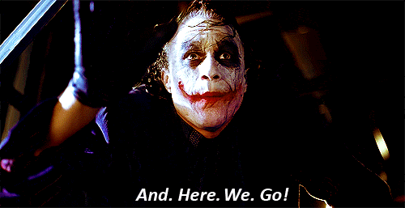

# And_Here_we_Go
I'm not stupid. I'm just too lazy to show how smart I am.


```
https://www.youtube.com/watch?v=24cQfQJ79Rs
```




In The Dark Knight (2008), the phrase "And here we go" is spoken by the Joker, played by Heath Ledger. 
It occurs in a pivotal moment during the movie when the Joker is about to carry out a dangerous and chaotic plan, further escalating the conflict between him and Batman.


### Context:

The scene takes place after the Joker has caused chaos and confusion in Gotham City.
He is prepared to **push things** further by manipulating situations to create fear, confusion, and destruction.
When the Joker says "And here we go," it marks the beginning of an intense, unpredictable phase in his plan, and signifies his enjoyment in the chaos he is about to create.


**Psychological games:**

The Joker uses this phrase to signal that his next move, which may seem irrational or dangerous, is part of his broader goal of creating disorder and testing people's morality. It's about pushing Batman and others to the limits of their tolerance and sanity.

**Anticipation of chaos:**

The Joker thrives on creating mayhem, and "And here we go" is his way of expressing excitement for the chaos he’s about to unleash. It shows his lack of concern for the consequences and his complete embrace of anarchy.


**My push things:**

Create a function for a quick way to commit and push changes using a single command.

```
gitHereWeGo
```

Copy the script below and paste it into your .bashrc file:

```
print_phrase() {
    figlet "And Here We Go"
}

print_face() {
    echo -e "\e[31m⠀⠀⠀⣿⣿⣷⣤⡀⠀⠀⠀⠀⠀⠀⠀⠀⠀⠀⠀⠀⠀⠀⠀⠀⠀⠀⠀⠀⠀⠀\e[0m" # Green
    echo -e "\e[31m⠀⠀⢀⣿⣿⣿⣿⣿⣿⣆⡀⠀⠀⠀⠀⣠⣴⣦⡄⢤⣄⠀⠀⠀⠀⠀⠀⠀⠀⠀\e[0m"
    echo -e "\e[31m⠀⠀⢸⣿⣿⣿⣿⣿⣿⣿⣿⣷⣷⣶⣶⣿⣿⣿⣿⡀⣽⡿⣶⣦⡀⠀⠀⠀⠀⠀\e[0m"
    echo -e "\e[31m⠀⠀⣸⣿⣿⣿⣿⣿⣿⣿⣿⣿⣿⣿⣿⣿⣿⣿⣿⣷⡿⣿⣿⣿⣿⣆⠀⠀⠀⠀\e[0m" # Red
    echo -e "\e[31m⠀⠀⢻⣿⣿⣿⣿⣿⣿⣿⣿⣿⣿⣿⣿⣿⣿⣿⣿⣿⣾⣿⣿⣿⣿⣿⣦⠀⠀⠀\e[0m"
    echo -e "\e[31m⠀⠀⢾⣿⣿⣿⣿⣿⣿⣿⣿⣿⣿⣿⣿⣿⣿⡿⣟⣿⣿⣿⣿⣿⡿⢟⣿⣷⡀⠀\e[0m"
    echo -e "\e[31m⠀⠀⠘⣿⣿⣿⣿⣿⣿⣿⣿⣭⣿⣿⣽⣿⣽⣾⣿⣿⣿⠛⠉⠉⠀⢈⣿⣿⡇⠀\e[0m" # White
    echo -e "\e[31m⠀⠀⠀⢻⣿⣿⠛⠉⠛⠻⣿⣿⣿⣿⣿⣿⣿⣿⡿⠛⠡⠤⠄⠁⠀⠀⢻⣿⡇⠀\e[0m"
    echo -e "\e[31m⠀⠀⠀⠘⣿⣿⠄⠀⠀⠀⠀⠀⣉⠙⠋⢿⣿⣯⠀⠀⠀⠀⠀⠀⣰⣿⣿⡿⡃⠀\e[0m"
    echo -e "\e[31m⠀⠀⠀⠀⢹⣿⣇⣀⠀⠈⠉⠉⠁⠀⣤⢠⣿⣿⣧⡆⣤⣤⡀⣾⣿⣿⣿⢠⡇⠀\e[0m"
    echo -e "\e[31m⠀⠀⠀⠀⠀⣿⣿⣿⣷⣤⠄⣀⣴⣧⣹⣿⣿⣿⣿⣿⣿⣿⣿⣿⣿⣿⣿⢸⠇⠀\e[0m"
    echo -e "\e[31m⠀⠀⠀⠀⠀⠸⣿⣯⠉⣼⣿⣿⣿⣿⣿⣿⣿⣿⣿⣿⢿⣿⣿⣿⣿⡯⠁⡌⠀⠀\e[0m"
    echo -e "\e[31m⠀⠀⠀⠀⠀⠀⠙⢿⡄⢿⣿⣿⣿⣿⣿⣎⠙⠻⠛⣁⣼⣿⣿⡿⠛⠁⡸⠀⠀⠀\e[0m"
    echo -e "\e[31m⠀⠀⠀⠀⠀⠀⠀⠈⢿⡄⠉⣿⡿⣿⣿⣿⣿⣷⣬⣿⡿⠟⠋⢀⣴⡞⠁⠀⠀⠀\e[0m"
    echo -e "\e[31m⠀⠀⠀⠀⠀⠀⠀⠀⠈⢳⠀⠀⠀⠀⠉⠉⠋⠉⠉⠁⠀⢀⣴⣿⡿⠀⠀⠀⠀⠀\e[0m"
    echo -e "\e[31m⠀⠀⠀⠀⠀⠀⠀⠀⠀⠀⠀⠙⠻⣿⣿⣿⣿⣿⠿⢃⣴⣿⣿⣿⠃⠀⠀⠀⠀⠀\e[0m"
    echo -e "\e[31m⠀⠀⠀⠀⠀⠀⠀⠀⠀⠀⠀⠀⠀⠀⠙⢿⣿⣿⣿⣿⣿⣿⣿⠟⠀⠀⠀⠀⠀⠀\e[0m"
    echo -e "\e[31m⠀⠀⠀⠀⠀⠀⠀⠀⠀⠀⠀⠀⠀⠀⠀⠀⠈⠉⠛⠛⠉⠉⠀⠀⠀⠀⠀⠀⠀⠀\e[0m"
    echo -e "\e[33mAnd Here We Go\e[0m" # Yellow text for the phrase
}

function gitHereWeGo() {
    # Check if the repository has any uncommitted changes
    if git diff-index --quiet HEAD --; then
        echo "No changes to commit. Pushing existing commits."
        git push || { echo "Failed to push changes."; return 1; }
    else
        # Commit and push changes
        echo "Changes detected. Adding, committing, and pushing."
        git add . && git commit -m "And Here We Go" && git push || { echo "Failed to complete git operations."; return 1; }
        print_face
        print_phrase
    fi
}

#print_phrase
#print_face

alias githerewego='gitHereWeGo'
alias gitgo='gitHereWeGo'

```


